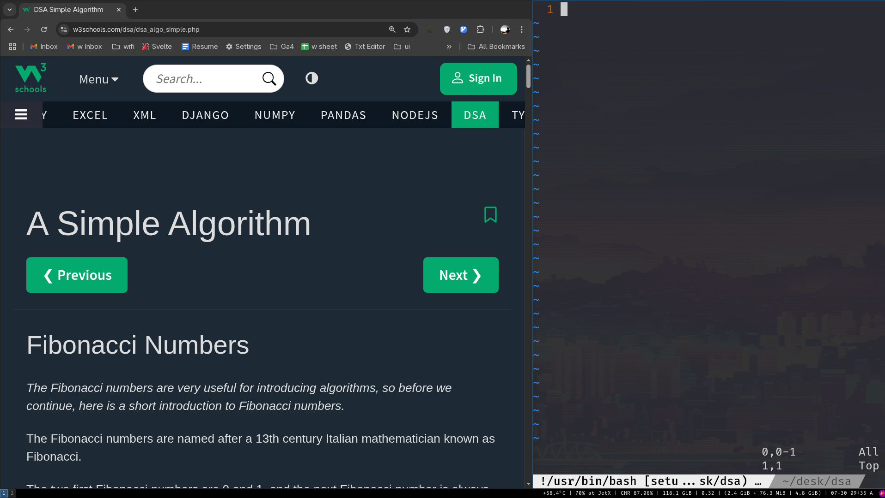

[7/30/2025, 9:30 a.m.] I have started DSA through w3schools currently I'm at this [page](https://www.w3schools.com/dsa/dsa_intro.php) let's see where I will tomorrow .

Sections I learned:
- [Simple Algorithm](https://www.w3schools.com/dsa/dsa_algo_simple.php)
- [Arrays](https://www.w3schools.com/dsa/dsa_data_arrays.php)
- [Time Complexity](https://www.w3schools.com/dsa/dsa_timecomplexity_theory.php)
- [Bubble Sort](https://www.w3schools.com/dsa/dsa_algo_bubblesort.php)

